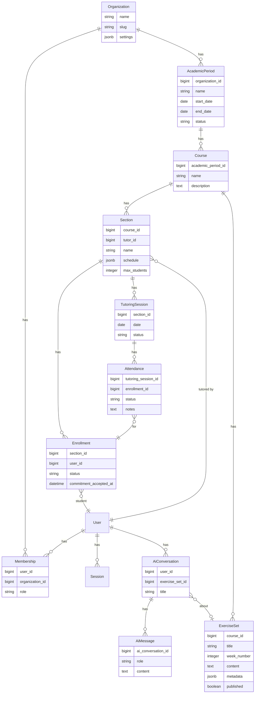
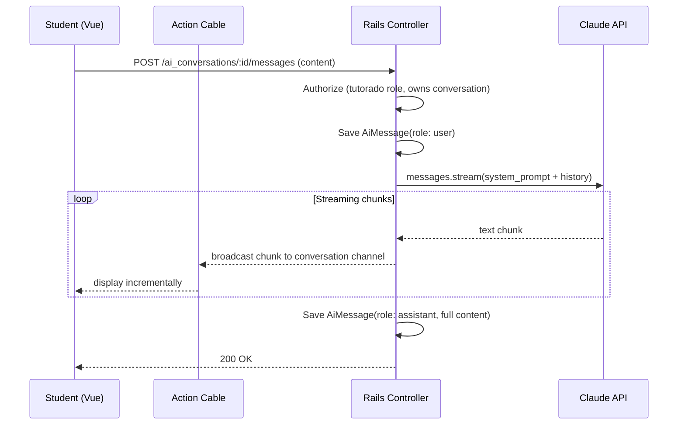

# feat: Crowquill Tutoring Platform MVP

## Overview

Build the MVP of Crowquill — a tutoring management platform initially targeting PIMU UC (Programa de Inserción a la Matemática Universitaria) but designed generically for any university/school tutoring program. The MVP covers role-based access (admin, tutor, tutorado), academic structure management, attendance tracking, LaTeX exercise management with KaTeX rendering, an AI chat tutor powered by Claude, and mobile-friendly responsive design with i18n (es/en).

## Problem Frame

PIMU UC runs free weekly math tutoring for first-year university students. Tutors are upper-year students who lead closed groups of ~12. The program currently lacks a dedicated digital platform — attendance, exercises, notifications, and coordination happen through ad-hoc tools. Crowquill will provide a unified platform where admins manage the program structure, tutors track attendance and deliver exercises, and students access exercises and get AI-assisted help understanding math concepts.

## Requirements Trace

- R1. **Role system**: Three roles (admin, tutor, tutorado) with appropriate access control
- R2. **Academic structure**: Organizations → Academic Periods → Courses → Sections with tutor assignment
- R3. **Enrollment**: Students enroll in sections, accept commitment letter, can withdraw
- R4. **Attendance tracking**: Tutors mark attendance per session; admins view/export statistics
- R5. **Exercise management**: Admins create/edit/delete exercises with LaTeX content, organized by course and week
- R6. **LaTeX rendering**: KaTeX client-side rendering for all math content
- R7. **AI chat tutor**: Claude-powered assistant that helps students understand exercises step-by-step (without giving direct answers)
- R8. **Role-based dashboards**: Each role sees relevant information and actions
- R9. **Mobile-friendly**: Touch targets ≥44px, responsive layouts, students primarily on mobile
- R10. **i18n**: Spanish default, English support, all new features fully translated
- R11. **Testing**: RSpec (backend) + Vitest (frontend), 80% coverage minimum
- R12. **Generic design**: Models and UI use generic naming (Organization, not "PIMU") to support other institutions later

## Scope Boundaries

- **No QR attendance** — manual attendance for MVP, QR in a future iteration
- **No self-assessment gamification** (stars/rewards) — deferred
- **No notification system** (email/push) — deferred
- **No admin impersonation** — deferred
- **No attendance export with color coding** — deferred (basic export only)
- **No multi-tenant UI** — single Organization seeded, no org management screens
- **No SSR** — client-side rendering only per CLAUDE.md
- **No absence justification workflow** — deferred
- **No section change requests** — deferred

## Context & Research

### Relevant Code and Patterns

- **Auth**: Fully built with Authentication Zero — User, Session, Current models. Session cookie auth with `has_secure_password`. Extend User with Membership for roles.
- **Controllers**: InertiaController base class shares auth data via `inertia_share`. Follow this pattern for sharing permissions.
- **Pages**: Follow existing convention at `app/frontend/pages/{resource}/index.vue` mapped to controller actions.
- **Components**: 28 shadcn-vue components installed. Form components in `app/frontend/components/form/` (FormInput, FormSelect, FormTextarea, etc.).
- **Layouts**: DashboardLayout with sidebar already exists. Auth layout for public pages.
- **i18n**: vue-i18n configured with `es`/`en`, cookie-based locale. One JSON file per domain in `app/frontend/i18n/locales/{es,en}/`.
- **Testing**: RSpec + FactoryBot + SimpleCov (backend), Vitest + Vue Test Utils + coverage-v8 (frontend). 80% threshold configured.

### External References

- **KaTeX + markdown-it**: Use `markdown-it` with `@mdit/plugin-katex` for proper math delimiter parsing in markdown. Handles `$...$` and `$$...$$` via AST-level integration, avoiding fragile regex. Add `katex` as peer dependency for rendering. Ref: [katex.org/docs/libs](https://katex.org/docs/libs), [@mdit/plugin-katex docs](https://mdit-plugins.github.io/katex.html)
- **Claude API**: Official `anthropic` gem (`~> 1.25`). Streaming via `client.messages.stream()` + Action Cable. Model: `claude-sonnet-4-5-20250929` for cost-effective tutoring. API key stored in Rails encrypted credentials (`bin/rails credentials:edit`), not ENV vars. Ref: [anthropic-sdk-ruby](https://github.com/anthropics/anthropic-sdk-ruby)
- **Authorization**: Plain Ruby policy objects + Inertia shared props (`usePage().props.can`). Server-side `before_action` guards as enforcement. `verify_authorized` pattern in base controller to prevent missed checks. Ref: [Inertia authorization guide](https://inertia-rails.dev/guide/authorization)
- **DOMPurify**: Client-side HTML sanitization before `v-html` rendering of markdown/LaTeX output. Defense-in-depth against XSS even though KaTeX output is safe. Ref: [DOMPurify](https://github.com/cure53/DOMPurify)

## Key Technical Decisions

- **KaTeX over MathJax**: Faster rendering, smaller bundle, covers 95% of math LaTeX. Sufficient for Precálculo/Cálculo I exercises.
- **markdown-it + @mdit/plugin-katex over custom regex parser**: Regex-based `$...$` detection in markdown is notoriously fragile (escaped dollars, code blocks, false positives on `$5`). The `@mdit/plugin-katex` integrates KaTeX into the markdown AST, handling all edge cases correctly. `MarkdownLatex.vue` becomes a thin wrapper around `markdown-it` with the plugin — no custom parsing logic. Also add `DOMPurify` to sanitize the HTML output before `v-html` rendering as defense-in-depth.
- **Policy objects with verify_authorized over gems (Pundit/CanCanCan)**: Custom policy objects are simpler for 3 roles and work naturally with Inertia prop sharing. The critical addition: a `verify_authorized` `after_action` in the base controller that raises if no policy check was called — this prevents silently granting access when a developer forgets to authorize. Default-deny posture.
- **Membership model for roles**: `users` stays clean (auth only). `memberships` handles organization-scoped roles. Easy path to multi-tenancy later. `current_organization` resolved via `Current.membership.organization` (set from membership lookup in `ApplicationController`), consistent with the existing `Current.session`/`Current.user` pattern. For single-tenant MVP, membership lookup uses `Organization.find_by!(slug: ENV["DEFAULT_ORG_SLUG"])`.
- **Action Cable over SSE for AI streaming**: Both were evaluated. SSE is simpler for unidirectional streams but ties up one Puma thread per connection (`ActionController::Live`), limiting concurrency. Action Cable multiplexes over a single WebSocket, doesn't burn Puma threads, provides channel-scoped subscription isolation (`stream_for conversation`), and supports future bidirectional needs (typing indicators, abort signals). `solid_cable` (already configured in Rails 8) uses PostgreSQL — no Redis needed. At `polling_interval: 0.1s`, latency is ~136ms avg which is imperceptible in token streaming.
- **Rails encrypted credentials for API keys**: Claude API key stored in `config/credentials.yml.enc` via `bin/rails credentials:edit`, not in ENV vars. Separate `config/credentials/production.yml.enc` with its own key. ENV vars can leak through process listings, error pages, or logging. Rails credentials are encrypted at rest and read at call time (supports rotation without code changes).
- **JSONB for section schedule**: Flexible schema for day/time/room. Avoids over-normalized schedule tables for MVP.
- **String-backed enums**: Per CLAUDE.md convention. All status/role fields use string enums.
- **Markdown + LaTeX for exercises**: Exercise content stored as markdown with embedded LaTeX delimiters (`$...$`, `$$...$$`). Rendered client-side with `markdown-it` + `@mdit/plugin-katex` + `DOMPurify`.
- **Claude Sonnet 4.5 for chat tutor**: Best cost/quality balance. System prompt constrains it to guide without giving answers. PII must be stripped before API calls (no user IDs, names, or emails sent to Claude).
- **Shallow route nesting**: Resources nested at most one level deep per Rails convention. Avoids brittle deep URLs like `/academic_periods/1/courses/2/sections/3`. Each record carries its parent FK, so parent context is recoverable without URL nesting.

## Open Questions

### Resolved During Planning

- **How to handle roles?** → Membership model with string enum role field scoped to Organization. User can have one membership per org.
- **Where to store exercises?** → ExerciseSet model with `content` text column (markdown+LaTeX). JSONB `metadata` for additional structure.
- **How to stream AI responses?** → Action Cable channel with `solid_cable` (PostgreSQL-backed, no Redis). Rails streams Claude API responses, Vue displays incrementally via `useAiChat` composable managing subscription lifecycle.
- **SSE vs Action Cable?** → Action Cable. SSE ties up Puma threads; Action Cable multiplexes, provides channel scoping, and `solid_cable` eliminates the Redis dependency.
- **How to parse LaTeX in markdown?** → `markdown-it` + `@mdit/plugin-katex` at the AST level. Regex-based `$...$` detection rejected as fragile.
- **How to resolve current organization?** → `Current.membership.organization`, set in `ApplicationController` from `current_user.memberships.find_by(organization: Organization.find_by!(slug: ENV["DEFAULT_ORG_SLUG"]))`. Consistent with existing `Current` pattern.
- **How to store API keys?** → Rails encrypted credentials (`config/credentials.yml.enc`), separate per environment. Not ENV vars.
- **How to prevent missed authorization checks?** → `verify_authorized` `after_action` in base controller that raises if no policy was invoked during the request. Default-deny posture.

### Deferred to Implementation

- **AI system prompt tuning** — needs iteration with real exercises to get the right pedagogical tone
- **Exercise content editor UX** — exact split-pane preview behavior to be refined during implementation
- **Attendance statistics aggregation** — exact query patterns depend on data volume and access patterns
- **DOMPurify allowlist configuration** — exact KaTeX HTML elements/attributes to allow needs testing with real content

## High-Level Technical Design

> *This illustrates the intended approach and is directional guidance for review, not implementation specification. The implementing agent should treat it as context, not code to reproduce.*

### Data Model (ERD)

### Request Flow (AI Chat)

## Implementation Units

- [ ] **Unit 1: Organization & Membership Models**

  **Goal:** Establish the multi-tenancy foundation and role system.

  **Requirements:** R1, R12

  **Dependencies:** None (extends existing User model)

  **Files:**
  - Create: `db/migrate/TIMESTAMP_create_organizations.rb`
  - Create: `db/migrate/TIMESTAMP_create_memberships.rb`
  - Create: `app/models/organization.rb`
  - Create: `app/models/membership.rb`
  - Modify: `app/models/user.rb` — add `has_many :memberships`
  - Create: `app/policies/application_policy.rb`
  - Create: `db/seeds.rb` — seed default Organization for PIMU UC
  - Test: `spec/models/organization_spec.rb`
  - Test: `spec/models/membership_spec.rb`

  **Approach:**
  - Organization: name, slug (unique index), settings (JSONB — stores rate limits, feature flags)
  - Membership: user_id, organization_id, role (string enum: `admin`, `tutor`, `tutorado`), unique index on [user_id, organization_id]
  - ApplicationPolicy base class with `initialize(membership, record)` pattern
  - Seed a "PIMU UC" organization in seeds.rb with slug matching `DEFAULT_ORG_SLUG` env var
  - Add `current_membership` to `Current` attributes, resolved in `ApplicationController` from `current_user.memberships.find_by(organization: Organization.find_by!(slug: ENV["DEFAULT_ORG_SLUG"]))`. This follows the existing `Current.session`/`Current.user` pattern
  - Add a `before_action` guard in `InertiaController` that redirects to an onboarding page when `current_membership` is nil — applied to all controllers except onboarding/settings. This keeps policies clean (always receive a valid membership)
  - Role assignment only through admin-protected flows. Strong parameters must explicitly exclude role from user-facing forms to prevent privilege escalation via mass assignment

  **Patterns to follow:**
  - Existing model structure in `app/models/user.rb` and `app/models/session.rb`
  - Existing `Current` attributes pattern in `app/models/current.rb`
  - String-backed enums per CLAUDE.md

  **Test scenarios:**
  - Membership validates role inclusion
  - Membership enforces uniqueness per user+org
  - User can have memberships in different orgs
  - Organization validates name presence and slug uniqueness
  - `current_membership` returns nil when user has no membership
  - User without membership is redirected to onboarding, not a crash
  - Role field cannot be set via user-facing form params (mass assignment protection)

  **Verification:**
  - Models pass all validations and associations
  - Seeds run without errors
  - `Current.membership` correctly resolves in controller context
  - Nil membership redirects to onboarding page

- [ ] **Unit 2: Authorization & Shared Permissions**

  **Goal:** Policy-based authorization with permissions shared to Vue via Inertia.

  **Requirements:** R1, R8

  **Dependencies:** Unit 1

  **Files:**
  - Modify: `app/controllers/application_controller.rb` — add `current_membership`, `authorize!`
  - Modify: `app/controllers/inertia_controller.rb` — share `can` permissions hash and `current_role`
  - Create: `app/policies/section_policy.rb`
  - Create: `app/policies/exercise_set_policy.rb`
  - Create: `app/policies/attendance_policy.rb`
  - Create: `app/frontend/composables/usePermissions.ts`
  - Create: `app/frontend/types/permissions.ts`
  - Test: `spec/policies/section_policy_spec.rb`
  - Test: `spec/frontend/unit/usePermissions.spec.ts`

  **Approach:**
  - Each policy class takes `(membership, record)`, exposes `can_*?` methods
  - InertiaController shares a `can` hash built from policies: `{ manage_sections: true, manage_exercises: true, take_attendance: true, ... }`
  - Also share `current_role` string for UI-level conditional rendering
  - `usePermissions()` composable wraps `usePage().props.can` with typed accessors
  - `authorize!` controller helper raises `Forbidden` if policy check fails, sets `@_authorized = true`
  - `verify_authorized` `after_action` in base controller — raises if no `authorize!` was called during the request. This prevents silently granting access when a developer forgets to add a policy check. Skip for whitelisted actions (onboarding, health checks)
  - Role hierarchy: admin > tutor > tutorado (admin can do everything tutor can, etc.)
  - Create `app/frontend/pages/errors/Forbidden.vue` and configure Inertia error handler in `createInertiaApp`. Without this, 403s fall through to Rails' default HTML error page, breaking the SPA experience. Alternatively, use `rescue_from` with flash message redirect for simpler MVP
  - Every request spec must include a test for unauthorized access (wrong role, wrong user, unauthenticated) to ensure coverage

  **Patterns to follow:**
  - Existing `inertia_share` block in InertiaController
  - Inertia authorization guide pattern

  **Test scenarios:**
  - Admin can manage sections, exercises, attendance
  - Tutor can take attendance, view own sections, view exercises
  - Tutorado can view enrolled sections, view exercises, cannot manage
  - Unauthorized access raises Forbidden and renders appropriate error
  - `usePermissions` returns correct booleans from page props
  - Controller without `authorize!` call raises in test (verify_authorized catches it)
  - 403 page renders correctly in Inertia (not raw HTML)

  **Verification:**
  - All policy specs pass
  - Shared `can` hash appears in Inertia page props
  - Frontend composable correctly reads permissions
  - verify_authorized catches any controller action that forgets to authorize

- [ ] **Unit 3: Academic Structure Models**

  **Goal:** Create AcademicPeriod, Course, and Section models with admin CRUD.

  **Requirements:** R2, R12

  **Dependencies:** Unit 1

  **Files:**
  - Create: `db/migrate/TIMESTAMP_create_academic_periods.rb`
  - Create: `db/migrate/TIMESTAMP_create_courses.rb`
  - Create: `db/migrate/TIMESTAMP_create_sections.rb`
  - Create: `app/models/academic_period.rb`
  - Create: `app/models/course.rb`
  - Create: `app/models/section.rb`
  - Create: `app/controllers/academic_periods_controller.rb`
  - Create: `app/controllers/courses_controller.rb`
  - Create: `app/controllers/sections_controller.rb`
  - Test: `spec/models/academic_period_spec.rb`
  - Test: `spec/models/course_spec.rb`
  - Test: `spec/models/section_spec.rb`
  - Test: `spec/requests/academic_periods_spec.rb`
  - Test: `spec/requests/courses_spec.rb`
  - Test: `spec/requests/sections_spec.rb`
  - Test: `spec/factories/academic_periods.rb`
  - Test: `spec/factories/courses.rb`
  - Test: `spec/factories/sections.rb`

  **Approach:**
  - AcademicPeriod: belongs_to :organization, has_many :courses. Status enum: `draft`, `active`, `archived`
  - Course: belongs_to :academic_period, has_many :sections, has_many :exercise_sets
  - Section: belongs_to :course, belongs_to :tutor (User), has_many :enrollments, has_many :tutoring_sessions. JSONB schedule field `{ day: "monday", start_time: "14:00", end_time: "15:30", room: "S301" }`
  - RESTful controllers with standard CRUD, scoped through current organization
  - All controllers inherit from InertiaController, render Inertia responses
  - Shallow route nesting (max 1 level deep): nest `courses` under `academic_periods` for index/create only, `sections` under `courses` for index/create only. Show/edit/update/destroy use top-level routes. This avoids brittle deep URLs and simplifies Inertia `Link` paths

  **Patterns to follow:**
  - Existing controller patterns (DashboardController, SessionsController)
  - RESTful resources per CLAUDE.md

  **Test scenarios:**
  - AcademicPeriod validates dates (end > start)
  - Course belongs to academic period, name is required
  - Section validates max_students > 0, tutor must exist
  - Section schedule JSONB stores day/time/room correctly
  - Admin can CRUD all resources
  - Tutor can only view, not create/update/delete
  - Tutorado cannot access admin routes

  **Verification:**
  - All models, migrations, and request specs pass
  - Routes resolve correctly with nesting

- [ ] **Unit 4: Academic Structure Frontend Pages**

  **Goal:** Admin UI for managing periods, courses, and sections. Tutor view of assigned sections.

  **Requirements:** R2, R8, R9, R10

  **Dependencies:** Unit 2, Unit 3

  **Files:**
  - Create: `app/frontend/pages/academic_periods/index.vue`
  - Create: `app/frontend/pages/academic_periods/new.vue`
  - Create: `app/frontend/pages/academic_periods/edit.vue`
  - Create: `app/frontend/pages/courses/index.vue`
  - Create: `app/frontend/pages/courses/new.vue`
  - Create: `app/frontend/pages/courses/edit.vue`
  - Create: `app/frontend/pages/sections/index.vue`
  - Create: `app/frontend/pages/sections/show.vue`
  - Create: `app/frontend/pages/sections/new.vue`
  - Create: `app/frontend/pages/sections/edit.vue`
  - Create: `app/frontend/i18n/locales/es/academic.json`
  - Create: `app/frontend/i18n/locales/en/academic.json`
  - Create: `app/frontend/types/academic.ts`
  - Modify: `app/frontend/components/NavMain.vue` — add academic nav items
  - Test: `spec/frontend/components/academic_periods_index.spec.ts`
  - Test: `spec/frontend/components/sections_show.spec.ts`

  **Approach:**
  - List pages use shadcn-vue Card + table-like layout for desktop, stacked cards for mobile
  - Forms use existing form components (FormInput, FormSelect, FormDatePicker)
  - Section show page is the hub: displays schedule, tutor, enrolled students, upcoming sessions
  - Sidebar navigation updated with academic structure items (admin sees management, tutor sees "My Sections")
  - All text through `$t()` with both locale files
  - TypeScript interfaces for all props in `types/academic.ts`
  - Responsive: mobile-first layouts, 44px touch targets

  **Patterns to follow:**
  - Existing page structure in `app/frontend/pages/dashboard/index.vue`
  - Form components in `app/frontend/components/form/`
  - i18n pattern with one JSON per domain

  **Test scenarios:**
  - Periods index renders list of periods
  - Course form validates required fields
  - Section show page displays enrolled students
  - Navigation items change based on role
  - All text uses i18n keys (no hardcoded strings)

  **Verification:**
  - All pages render correctly with Inertia props
  - Forms submit via `useForm()` with validation error display
  - Navigation reflects current user's role
  - Responsive layout works on mobile viewports

- [ ] **Unit 5: Enrollment System**

  **Goal:** Students enroll in sections with commitment acceptance. Tutors see their roster.

  **Requirements:** R3

  **Dependencies:** Unit 3

  **Files:**
  - Create: `db/migrate/TIMESTAMP_create_enrollments.rb`
  - Create: `app/models/enrollment.rb`
  - Create: `app/controllers/enrollments_controller.rb`
  - Create: `app/frontend/pages/enrollments/new.vue` (section browse + enroll)
  - Create: `app/frontend/components/CommitmentDialog.vue`
  - Create: `app/frontend/i18n/locales/es/enrollment.json`
  - Create: `app/frontend/i18n/locales/en/enrollment.json`
  - Test: `spec/models/enrollment_spec.rb`
  - Test: `spec/requests/enrollments_spec.rb`
  - Test: `spec/factories/enrollments.rb`
  - Test: `spec/frontend/components/CommitmentDialog.spec.ts`

  **Approach:**
  - Enrollment: section_id, user_id, status (`active`, `withdrawn`), commitment_accepted_at. Unique index on [section_id, user_id]
  - Student browses available sections for their courses, clicks enroll
  - CommitmentDialog: modal (shadcn Dialog) with program terms, must accept before enrollment completes
  - Enrollment sets `commitment_accepted_at` on creation
  - Withdrawal: student can set status to `withdrawn` (soft delete, preserves history)
  - **Enrollment capacity enforcement via pessimistic locking**: wrap enrollment creation in `section.with_lock { ... }` (row-level lock on Section). Inside the lock: count active enrollments, reject if `>= max_students`, create if under limit. This prevents the TOCTOU race condition where concurrent requests both pass the count check. The unique index on [section_id, user_id] separately prevents duplicate enrollments
  - **Idempotent endpoint**: if a student double-clicks or client retries, return the existing enrollment rather than an error
  - Admin can also enroll/remove students manually

  **Patterns to follow:**
  - Existing Dialog component from shadcn-vue
  - `useForm()` for enrollment submission

  **Test scenarios:**
  - Student can enroll in a section with available spots
  - Enrollment fails when section is full
  - **Concurrent enrollment attempts do not exceed max_students** (race condition test)
  - Enrollment requires commitment acceptance
  - Student can withdraw (status changes, record preserved)
  - Duplicate enrollment returns existing record (idempotent)
  - Admin can enroll students in any section

  **Verification:**
  - Enrollment flow works end-to-end
  - Commitment dialog blocks enrollment until accepted
  - Max students constraint enforced

- [ ] **Unit 6: Tutoring Sessions & Attendance**

  **Goal:** Tutors create sessions and mark attendance. Admins view attendance statistics.

  **Requirements:** R4

  **Dependencies:** Unit 5

  **Files:**
  - Create: `db/migrate/TIMESTAMP_create_tutoring_sessions.rb`
  - Create: `db/migrate/TIMESTAMP_create_attendances.rb`
  - Create: `app/models/tutoring_session.rb`
  - Create: `app/models/attendance.rb`
  - Create: `app/controllers/tutoring_sessions_controller.rb`
  - Create: `app/controllers/attendances_controller.rb`
  - Create: `app/frontend/pages/tutoring_sessions/index.vue`
  - Create: `app/frontend/pages/tutoring_sessions/show.vue` (attendance taking UI)
  - Create: `app/frontend/components/AttendanceGrid.vue`
  - Create: `app/frontend/i18n/locales/es/attendance.json`
  - Create: `app/frontend/i18n/locales/en/attendance.json`
  - Test: `spec/models/tutoring_session_spec.rb`
  - Test: `spec/models/attendance_spec.rb`
  - Test: `spec/requests/tutoring_sessions_spec.rb`
  - Test: `spec/requests/attendances_spec.rb`
  - Test: `spec/factories/tutoring_sessions.rb`
  - Test: `spec/factories/attendances.rb`
  - Test: `spec/frontend/components/AttendanceGrid.spec.ts`

  **Approach:**
  - TutoringSession: section_id, date, status (`scheduled`, `completed`, `cancelled`). Auto-generated from section schedule or created manually by tutor.
  - Attendance: tutoring_session_id, enrollment_id, status (`present`, `absent`, `justified`), notes. Unique index on [tutoring_session_id, enrollment_id]
  - AttendanceGrid component: mobile-friendly grid showing all enrolled students with toggle buttons (present/absent). Optimized for quick tap on mobile.
  - Tutor opens session → sees student list → taps to mark present/absent → submits batch
  - Bulk upsert endpoint: `PATCH /tutoring_sessions/:id/attendances` with array of statuses. Uses transactional upsert (`find_or_initialize_by` within a transaction, or `upsert_all` with the unique index on [tutoring_session_id, enrollment_id]). First attendance-taking creates records; subsequent calls update existing ones. All within a single transaction for atomicity
  - Admin dashboard shows attendance statistics per section/student (basic counts for MVP)

  **Patterns to follow:**
  - shadcn-vue Button variants for attendance status toggles
  - `useForm()` for batch submission

  **Test scenarios:**
  - Tutor can create a session for their section
  - Tutor can mark attendance for all enrolled students
  - Attendance defaults to absent if not marked
  - Cannot mark attendance for non-enrolled students
  - Admin can view attendance across all sections
  - Session status transitions are valid (scheduled → completed)
  - AttendanceGrid renders student list with status toggles

  **Verification:**
  - Attendance taking flow works end-to-end on mobile viewport
  - Batch update saves all attendance records atomically
  - Statistics queries return correct counts

- [ ] **Unit 7: Exercise Management with LaTeX**

  **Goal:** Admins create/edit exercises with LaTeX content. All roles view rendered exercises.

  **Requirements:** R5, R6

  **Dependencies:** Unit 3

  **Files:**
  - Create: `db/migrate/TIMESTAMP_create_exercise_sets.rb`
  - Create: `app/models/exercise_set.rb`
  - Create: `app/controllers/exercise_sets_controller.rb`
  - Create: `app/frontend/pages/exercise_sets/index.vue`
  - Create: `app/frontend/pages/exercise_sets/show.vue`
  - Create: `app/frontend/pages/exercise_sets/new.vue`
  - Create: `app/frontend/pages/exercise_sets/edit.vue`
  - Create: `app/frontend/components/LatexRenderer.vue`
  - Create: `app/frontend/components/MarkdownLatex.vue`
  - Create: `app/frontend/components/ExerciseEditor.vue`
  - Create: `app/frontend/i18n/locales/es/exercises.json`
  - Create: `app/frontend/i18n/locales/en/exercises.json`
  - Test: `spec/models/exercise_set_spec.rb`
  - Test: `spec/requests/exercise_sets_spec.rb`
  - Test: `spec/factories/exercise_sets.rb`
  - Test: `spec/frontend/components/LatexRenderer.spec.ts`
  - Test: `spec/frontend/components/ExerciseEditor.spec.ts`

  **Approach:**
  - ExerciseSet: course_id, title, week_number, content (text — markdown with LaTeX), metadata (JSONB), published (boolean, default false)
  - `LatexRenderer.vue`: thin component that takes a LaTeX string, calls `katex.renderToString()`, outputs via `v-html` after DOMPurify sanitization. Props: `expression`, `displayMode`
  - `MarkdownLatex.vue`: renders markdown content using `markdown-it` with `@mdit/plugin-katex` (handles `$...$` inline and `$$...$$` display delimiters at AST level — no fragile regex). Output sanitized with DOMPurify before `v-html`. Configure DOMPurify allowlist for KaTeX HTML elements (`span`, `math`, `semantics`, `mrow`, `mi`, `mo`, `mn`, `msup`, `mfrac`) and restricted attributes (`class`, `style`)
  - `ExerciseEditor.vue`: split-pane editor (textarea left, rendered preview right). Admin types markdown+LaTeX, sees live preview. On mobile, toggle between edit/preview tabs.
  - npm dependencies: `bun add katex @types/katex markdown-it @mdit/plugin-katex dompurify @types/dompurify`
  - Import KaTeX CSS in entrypoint for proper rendering styles
  - Exercises organized by course and week_number, sortable
  - Published flag controls student visibility (draft exercises hidden from tutorados)

  **Patterns to follow:**
  - Existing form components for metadata fields
  - shadcn-vue Tabs for mobile edit/preview toggle

  **Test scenarios:**
  - LatexRenderer renders simple expressions (`\frac{1}{2}`)
  - LatexRenderer handles invalid LaTeX gracefully (shows error, doesn't crash)
  - MarkdownLatex renders mixed markdown and LaTeX
  - ExerciseEditor shows live preview matching input
  - Admin can create, edit, publish, unpublish exercises
  - Tutor can view published exercises for their courses
  - Tutorado can view published exercises for enrolled courses only
  - Exercise set validates title and content presence

  **Verification:**
  - LaTeX renders correctly on mobile and desktop
  - Editor preview matches final rendered output
  - Published/draft filtering works per role

- [ ] **Unit 8: Role-Based Dashboards**

  **Goal:** Each role sees a tailored dashboard with relevant information and quick actions.

  **Requirements:** R8, R9, R10

  **Dependencies:** Unit 4, Unit 5, Unit 6, Unit 7

  **Files:**
  - Modify: `app/controllers/dashboard_controller.rb` — build role-specific props
  - Modify: `app/frontend/pages/dashboard/index.vue` — role-based rendering
  - Create: `app/frontend/components/dashboard/AdminDashboard.vue`
  - Create: `app/frontend/components/dashboard/TutorDashboard.vue`
  - Create: `app/frontend/components/dashboard/TutoradoDashboard.vue`
  - Create: `app/frontend/i18n/locales/es/dashboard.json`
  - Create: `app/frontend/i18n/locales/en/dashboard.json`
  - Test: `spec/requests/dashboard_spec.rb`
  - Test: `spec/frontend/components/AdminDashboard.spec.ts`
  - Test: `spec/frontend/components/TutorDashboard.spec.ts`
  - Test: `spec/frontend/components/TutoradoDashboard.spec.ts`

  **Approach:**
  - Dashboard controller detects current_membership.role and builds appropriate props
  - **Admin**: active period summary, total students/tutors/sections, attendance overview, recent activity
  - **Tutor**: my sections list, upcoming sessions, attendance alerts (students with 2+ consecutive absences), quick link to take attendance
  - **Tutorado**: my enrolled sections, next session info, weekly exercises, link to AI chat
  - Single page component (`dashboard/index.vue`) that delegates to role-specific sub-components
  - Mobile-optimized: card-based layout, most important info first
  - All dashboard text through i18n

  **Patterns to follow:**
  - Existing dashboard page structure
  - shadcn-vue Card components for dashboard widgets

  **Test scenarios:**
  - Admin dashboard shows program-wide statistics
  - Tutor dashboard shows only their assigned sections
  - Tutorado dashboard shows only enrolled sections and exercises
  - Dashboard renders correct component based on role
  - Unauthenticated users redirected to login
  - Users without membership see an onboarding state

  **Verification:**
  - Each role sees appropriate dashboard content
  - Dashboard loads efficiently (no N+1 queries)
  - Mobile layout prioritizes actionable information

- [ ] **Unit 9: AI Chat Tutor**

  **Goal:** Claude-powered chat assistant that helps students understand math exercises step-by-step.

  **Requirements:** R7

  **Dependencies:** Unit 7 (exercises exist for context)

  **Files:**
  - Create: `db/migrate/TIMESTAMP_create_ai_conversations.rb`
  - Create: `db/migrate/TIMESTAMP_create_ai_messages.rb`
  - Create: `app/models/ai_conversation.rb`
  - Create: `app/models/ai_message.rb`
  - Create: `app/services/ai_tutor_service.rb`
  - Create: `app/controllers/ai_conversations_controller.rb`
  - Create: `app/controllers/ai_messages_controller.rb`
  - Create: `app/channels/ai_conversation_channel.rb`
  - Create: `app/frontend/pages/ai_conversations/index.vue`
  - Create: `app/frontend/pages/ai_conversations/show.vue`
  - Create: `app/frontend/components/ChatMessage.vue`
  - Create: `app/frontend/components/ChatInput.vue`
  - Create: `app/frontend/composables/useAiChat.ts`
  - Create: `app/frontend/i18n/locales/es/ai.json`
  - Create: `app/frontend/i18n/locales/en/ai.json`
  - Modify: `Gemfile` — add `anthropic` gem
  - Test: `spec/models/ai_conversation_spec.rb`
  - Test: `spec/models/ai_message_spec.rb`
  - Test: `spec/services/ai_tutor_service_spec.rb`
  - Test: `spec/requests/ai_conversations_spec.rb`
  - Test: `spec/requests/ai_messages_spec.rb`
  - Test: `spec/factories/ai_conversations.rb`
  - Test: `spec/factories/ai_messages.rb`
  - Test: `spec/frontend/components/ChatMessage.spec.ts`
  - Test: `spec/frontend/unit/useAiChat.spec.ts`

  **Approach:**
  - AiConversation: user_id, exercise_set_id (optional — can start from an exercise or freely), title
  - AiMessage: ai_conversation_id, role (`user`, `assistant`), content (text — may contain LaTeX), **status** (`complete`, `streaming`, `failed`), **input_tokens** (integer, nullable), **output_tokens** (integer, nullable). The status column is the source of truth for message state. Token columns enable cost monitoring per student without reprocessing
  - **Action Cable authentication**: `ApplicationCable::Connection#connect` must look up the session from `cookies.signed[:session_token]` (same cookie used by HTTP auth) and call `reject_unauthorized_connection` if invalid. This runs outside the controller lifecycle — `Current` is not populated and `before_action` filters don't apply
  - **Channel-level authorization**: `AiConversationChannel#subscribed` must verify `conversation.user_id == current_user.id` before streaming. Without this, any authenticated user could subscribe to another user's conversation. Broadcast stream names use `"ai_conversation_#{conversation.id}"` — never derived from client input without validation
  - **Configure `allowed_request_origins`** in production Action Cable config to only accept the application domain (CSRF mitigation for WebSocket)
  - **PII stripping**: AiTutorService must never include user_id, student names, emails, or any direct identifiers in Claude API requests. Only the conversation history (messages) and exercise content are sent. System prompt contains no student-specific data
  - **Consent**: First time a student opens AI chat, show a consent dialog explaining: what data is sent, to whom (Anthropic), for what purpose, and that conversations are stored. Record consent timestamp on the AiConversation or a separate user consent record. Required under Chilean Law 21.719 (data protection)
  - **Prompt injection defense**: System prompt uses clear separation markers. AI responses are sanitized server-side before storage and broadcast. Never include internal system details, other students' data, or admin information in the system prompt context
  - AiTutorService: wraps Claude API call. Reads API key from Rails encrypted credentials (`Rails.application.credentials.anthropic_api_key`). Builds messages array from conversation history. System prompt instructs Claude to be a Socratic math tutor — guide with questions, don't give answers directly, use LaTeX for math, respond in the user's language
  - **Streaming recovery protocol**:
    1. Create `AiMessage` record with `status: "streaming"` before starting the Claude API call
    2. Broadcast chunks with sequence numbers. Broadcast a final `{ type: "done", message_id: N }` event on completion
    3. On Claude API error, broadcast `{ type: "error", message_id: N }` and update record to `status: "failed"`
    4. On successful completion, update to `status: "complete"` with full content and token counts
    5. `useAiChat` composable: on Action Cable reconnect, fetch conversation state via Inertia visit to reconcile. If a message is `status: "streaming"` but no chunks arrive within timeout, show "response interrupted" with retry button
  - `useAiChat.ts`: manages Action Cable subscription lifecycle (subscribe/unsubscribe on mount/unmount), accumulates streamed text, handles reconnection, exposes reactive `messages` ref and `send(content)` method
  - ChatMessage renders with MarkdownLatex component (reused from Unit 7) so AI math responses render beautifully
  - ChatInput: textarea with send button, supports Enter to send (Shift+Enter for newline)
  - Student can start chat from exercise page ("Ask AI about this exercise") or from standalone chat page
  - Conversation list page shows history of past conversations
  - **Multi-layer rate limiting**: (1) per-user message count per hour, (2) per-user token budget per day (tracked via input_tokens/output_tokens columns), (3) max concurrent WebSocket connections per user. Limits configurable via Organization settings JSONB. Graceful degradation: WebSocket sends structured error message the client displays, not silent drops
  - Add AI conversation content to `filter_parameter_logging` initializer to prevent sensitive content appearing in Rails logs

  **Patterns to follow:**
  - Action Cable pattern from Rails guides
  - MarkdownLatex component from Unit 7 for rendering AI responses
  - `useForm()` not used here — custom composable for WebSocket-based interaction

  **Test scenarios:**
  - AiTutorService builds correct message payload with system prompt
  - AiTutorService handles Claude API errors gracefully (broadcasts error, updates status to "failed")
  - **AiTutorService never includes PII (user_id, name, email) in API payload**
  - Streaming broadcasts chunks to correct channel with sequence numbers
  - **Unauthorized user cannot subscribe to another user's conversation channel**
  - **Unauthenticated WebSocket connection is rejected**
  - Only tutorados (and tutors/admins for testing) can create conversations
  - Conversations are scoped to current user
  - ChatMessage renders LaTeX in AI responses
  - useAiChat composable accumulates streamed text correctly
  - **Streaming recovery: client handles reconnection and reconciles state**
  - Rate limiting prevents excessive API calls (message count and token budget)
  - Conversation can be started with exercise context
  - **Consent dialog shown on first AI chat use**
  - Token counts captured from Claude API response and stored on AiMessage

  **Verification:**
  - End-to-end chat flow: send message → see streamed response with LaTeX
  - AI responses are pedagogically appropriate (guided, not direct answers)
  - Chat works smoothly on mobile
  - Action Cable connection is authenticated and reconnects
  - Failed/interrupted streams show appropriate UI state with retry option
  - API key read from Rails credentials, not ENV

- [ ] **Unit 10: Navigation, Sidebar & Global Layout Updates**

  **Goal:** Update sidebar navigation and global layout to reflect all new features per role.

  **Requirements:** R8, R9, R10

  **Dependencies:** Unit 2 (permissions), Unit 4, Unit 8

  **Files:**
  - Modify: `app/frontend/components/NavMain.vue` — role-based nav items
  - Modify: `app/frontend/components/AppSidebar.vue` — update structure
  - Modify: `app/frontend/layouts/app/AppSidebarLayout.vue` — mobile optimizations
  - Modify: `app/frontend/i18n/locales/es/nav.json` — add new nav keys
  - Modify: `app/frontend/i18n/locales/en/nav.json` — add new nav keys
  - Modify: `config/routes.rb` — all new routes
  - Test: `spec/frontend/components/NavMain.spec.ts`

  **Approach:**
  - Sidebar shows different items per role:
    - **Admin**: Dashboard, Academic Periods, Courses, Sections, Exercises, Attendance Reports, Settings
    - **Tutor**: Dashboard, My Sections, Exercises, Settings
    - **Tutorado**: Dashboard, My Sections, Exercises, AI Chat, Settings
  - Mobile: sidebar collapses to bottom tab bar with most important items (4-5 tabs)
  - Routes organized with RESTful nesting where appropriate
  - All nav labels through i18n

  **Patterns to follow:**
  - Existing NavMain and sidebar structure
  - shadcn-vue NavigationMenu components

  **Test scenarios:**
  - Admin sees all nav items
  - Tutor sees limited nav items
  - Tutorado sees student-specific items including AI Chat
  - Mobile bottom nav shows correct subset
  - All nav labels are i18n keys

  **Verification:**
  - Navigation matches role across all viewports
  - All routes accessible from nav items
  - No broken links

## System-Wide Impact

- **Interaction graph:** Authentication middleware → Membership lookup (`Current.membership`) → Policy checks (`authorize!`) → `verify_authorized` after_action → Controller actions → Inertia rendering. Action Cable for AI streaming runs parallel to HTTP request cycle with its own auth path (`ApplicationCable::Connection` → session cookie lookup → channel subscription authorization).
- **Error propagation:** Controller authorization failures return 403 via Inertia error page (`errors/Forbidden.vue`). Claude API failures broadcast structured error events over Action Cable, update AiMessage status to "failed", and show retry UI. Form validation errors flow back automatically via Inertia. Rate limit exceeded returns structured WebSocket error (not silent drop).
- **State lifecycle risks:** AI streaming uses a 3-state message lifecycle (`streaming` → `complete` | `failed`). If connection drops mid-stream, the server-side streaming job continues and saves the complete message. Client reconciles on reconnect by fetching conversation state. Attendance batch update uses transactional upsert for atomicity. Enrollment capacity check uses pessimistic row locking to prevent race conditions.
- **WebSocket security surface:** Action Cable connections authenticated via `cookies.signed[:session_token]` in `Connection#connect`. Channel subscriptions verify resource ownership. `allowed_request_origins` configured in production. AI conversation content excluded from Rails log parameters.
- **Content Security Policy:** Enable CSP in `config/initializers/content_security_policy.rb` (currently commented out) with `script-src 'self'`, `style-src 'self' 'unsafe-inline'` (KaTeX requires inline styles), `connect-src 'self' wss:` (Action Cable). CSP is the defense-in-depth layer for XSS.
- **Data privacy:** Student AI conversations sent to Anthropic API without PII. Consent recorded before first AI use. Content filtered from Rails logs. Retention policy to be defined (right to deletion under Chilean Law 21.719).
- **API surface parity:** No separate API endpoints for MVP. All through Inertia. Action Cable is the only WebSocket surface.
- **Integration coverage:** Auth → Membership → Policy → verify_authorized → Controller → Inertia rendering chain needs integration tests. AI chat streaming needs end-to-end test with mocked Claude API. Action Cable auth needs test for unauthorized subscription rejection. Enrollment race condition needs concurrent request test.

## Risks & Dependencies

- **Claude API cost**: AI chat could get expensive with many students. Mitigate with multi-layer rate limiting (message count + token budget per user per day), Sonnet model (cheaper), and token tracking on AiMessage records. Set spend limits on Anthropic account. Monitor per-student cost via token columns.
- **Data privacy / Chilean Law 21.719**: Student conversation data constitutes personal data when linked to user_id. Mitigate by: stripping PII before API calls, recording explicit informed consent before first AI use, filtering AI content from Rails logs, defining data retention policy, and reviewing Anthropic's data processing terms. A compromised API key could also expose conversation content.
- **Prompt injection**: Students could craft "math questions" designed to manipulate Claude into revealing system prompts, generating harmful content, or exfiltrating context. Mitigate with: strict system prompt separation markers, never including sensitive data in system prompt, server-side output sanitization before storage/broadcast, and monitoring for anomalous response patterns.
- **API key security**: Claude API key grants unbounded spend. Store in Rails encrypted credentials (not ENV). Use separate credentials per environment. Key rotation requires only app restart (service reads at call time, not boot). Set Anthropic account spend limits as backstop.
- **KaTeX limitations**: Some advanced LaTeX not supported. For Precálculo/Cálculo I this is acceptable. Document unsupported commands if discovered.
- **Action Cable stability on mobile**: WebSocket connections can be flaky on mobile networks. `useAiChat` composable handles reconnection and state reconciliation. Message status column (`streaming`/`complete`/`failed`) enables recovery. `solid_cable` with PostgreSQL is production-ready at expected scale (~100 concurrent users).
- **Exercise content migration**: If PIMU UC has existing exercises in other formats, a migration/import tool may be needed. Deferred — manual entry for MVP.
- **Performance**: Dashboard queries touching multiple tables need careful eager loading. Use `includes()` and consider counter caches for attendance statistics. Enrollment capacity checks use row locking (brief, acceptable overhead).
- **Dependency security**: Run `bundler-audit` and `brakeman` in CI with zero-warning policy. Add `bun audit` for frontend. Pin `anthropic` gem version and monitor for advisories. Enable CSP in production.

## Phased Delivery

### Phase 1: Foundation (Units 1-2)

Organization, Membership, roles, authorization, shared permissions, verify_authorized pattern, CSP activation. The base everything else builds on.

### Phase 2: Academic Structure (Units 3-5)

Periods, courses, sections, enrollments with pessimistic locking. The domain model for program management.

### Phase 3: Core Operations (Units 6-7)

Attendance tracking (transactional upsert) and exercise management with markdown-it + KaTeX + DOMPurify. The daily operational tools.

### Phase 4: Intelligence & Polish (Units 8-10)

Role-based dashboards, AI chat tutor (Action Cable auth, PII stripping, consent, streaming recovery, rate limiting), navigation updates. The user experience layer.

## Sources & References

- PIMU UC: [pimu.mat.uc.cl](https://pimu.mat.uc.cl/)
- PIMU news: [Tutorías PIMU reconocidas por la UC](https://www.mat.uc.cl/noticias/2024-03-22/tutorias-pimu-son-reconocidas-por-la-uc-como-iniciativa-co-curricular.html)
- User stories: `/Users/crowdev/dev/personal/crowquill/historias.csv`
- KaTeX: [katex.org/docs/libs](https://katex.org/docs/libs)
- @mdit/plugin-katex: [mdit-plugins.github.io/katex](https://mdit-plugins.github.io/katex.html)
- DOMPurify: [github.com/cure53/DOMPurify](https://github.com/cure53/DOMPurify)
- Anthropic Ruby SDK: [github.com/anthropics/anthropic-sdk-ruby](https://github.com/anthropics/anthropic-sdk-ruby)
- Inertia.js Authorization: [inertia-rails.dev/guide/authorization](https://inertia-rails.dev/guide/authorization)
- Action Cable Guide: [Rails Guides](https://guides.rubyonrails.org/action_cable_overview.html)
- solid_cable: [github.com/rails/solid_cable](https://github.com/rails/solid_cable)
- Chilean Law 21.719 (Data Protection): applicable to student data sent to external AI APIs
